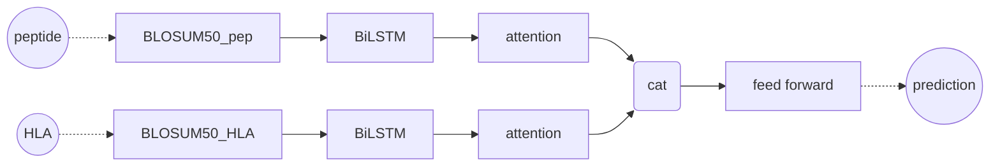
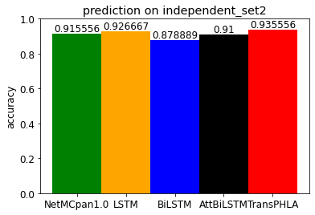
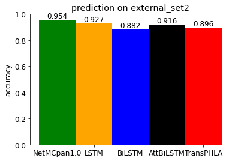
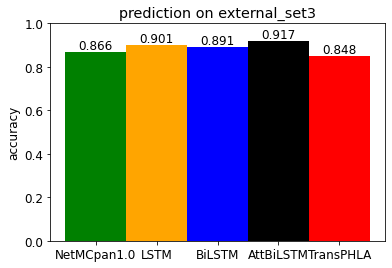

# Predicting the binding of peptide and HLA Class I

# 介绍
### 文件简介
- 文件夹
  - ``data_csv`` : 存放train_set, test_set的csv文件
  - ``model`` : 存放模型参数文件(.pkl)
- 文件
  - ``task_models.py`` 存放搭建的模型，输入是氨基酸编码序列，输出是预测值
  - ``modelx_xxx.ipynb`` 各模型的训练、评估、测试

  - ``model.py``、``vocab_dict.npy``是TransPHLA模型的文件，来自于 https://github.com/a96123155/TransPHLA-AOMP
  - ``test_TransPHLA.ipynb`` 测试使用TransPHLA模型的步骤
  - ``complete_models.py`` 存放完整的预测模型，输入数据集文件名，输出accuracy
  - ``compete.ipynb`` 比较不同模型的预测准确度

### 版本
* python 3.8
* pytorch 1.7.0 
* GPU GeForce MX250
* cuda 10.1

# 实现预测模型 

### model's formulation

Input: 
- Peptide sequence. (Length: 8-14)
- HLA Class I pseudo sequence. (Length: 34)

Output: 
- whether the peptides bind to the MHC molecule or not (0 or 1)
  - output of the model is a scalar, which is like "probability"
  - assuming that 'probability > 0.5' means binding(1), while 'probability < 0.5' means non-binding(0)

### model's training
数据集来源：TranPHLA模型的数据https://github.com/a96123155/TransPHLA-AOMP/tree/master/Dataset
- train_data_fold0-4  -->train
- independent_set     -->test
- external_set        -->test
- 训练数据集中的所有数据用时较长，因此仅使用数据集中的一小部分
  - train_data: 500 per fold
  - independent_set: ~900 
  - external_set: ~1000 

训练方式：
- five-fold CV
  - train_data --> _fold0/1/2/3/4
  - 四组训练，一组评估，取平均的评估结果
- 训练时先不分batch，单个数据输入，求loss
- epoch限制在30，这里选取epoch=30时的模型作为最终模型
- loss: MSE
- 参数优化：Adam

### model 1 --- NetMHCpan1.0
用BLOSUM50 Matrix编码氨基酸，peptide 与 HLA 编码序列结合起来一起输入模型
- 输入model的peptide固定长度14，长度不足的肽用‘X’填充

a conventional feed-forward network
- one hidden layer 
- a single neuron output layer

训练结果：

### model 2 --- NetMHCpan1.0_LSTM
先将peptide、HLA编码序列分别输入2个LSTM layer中，然后将两输出结果中的“ht”结合（cat）起来，输入model 1的network中

- LSTM layer: output_size is 16
- hidden layer: output_size is 60

LSTM输入的序列长度可以不受限制，考虑peptide填充和不填充两种编码方式

### model 3 --- NetMHCpan1.0_BiLSTM
LSTM-->BiLSTM，对于BiLSTM产生的双向状态h，这里没有处理（没有两状态相加或其他），只是将他们一块作为下一层的输入。

### model 4 --- NetMHCpan1.0_AttBiLSTM
BiLSTM输出后加入attention：

BiLSTM的output经处理后作为attention的输入，输出一串features：（一串因为batch_size=1）

$H_{s\times b\times h} = output[: ,: ,前一半]\oplus output[: ,: ,后一半]<-->双向状态相加$

$设训练参数w_{b\times 1 \times h}$

$H_{b\times h\times s} = H_{s\times b\times h}.permute(1,2,0)$

$M_{b\times h\times s} = tanh(H_{b\times h\times s})$

$注意力分布\alpha_{b\times 1 \times s} = softmax(w_{b\times 1 \times h}M_{b\times h \times s})$

$\alpha_{b\times s \times 1} = \alpha_{b\times 1 \times s}.transpose(1,2)$

$r_{b\times h \times 1} = H_{b\times h\times s}\alpha_{b\times s \times 1}$

### model's testing
将5-cv训练获得的五个模型放在independent_set2和external_set2上测试，看预测准确度，选择其中结果较好的用于最后的模型比较。
- 这里independent_set2中有不同长度的peptide，但分布不一定与train_data_fold的分布相同（因为都是直接从原数据集随机截取的）
- csv文件中的independent_set中peptide长度单一

# 模型比较
比较四种模型与TransPHLA的accuracy：
|independent_set2|external_set2|
|:-:|:-:|
|||

由于这四种模型是经independent_set2和external_set2测试挑选出来的，有一定的偏向性。再从external_set中挑出一组数据external_set3，比较：

使用全部数据集中的数据训练模型，再来比较会更有说服力

# 补充

### 氨基酸序列编码BLOSUM50
BLOSUM50 matrix ：

矩阵链接：https://www.ncbi.nlm.nih.gov/IEB/ToolBox/C_DOC/lxr/source/data/BLOSUM50#0009

补充：
* 20种氨基酸A、R、N......W、Y、V

* 除此之外，还有一些三字母或单字母符号可用来表示未明确定义的缩写：

  * Asx、B可代表天冬氨酸（Asp、D）或天冬酰胺（Asn、N）。
  * Glx、Z可代表谷氨酸（Glu、E）或谷氨酰胺（Gln、Q）。
  * Xle、J可代表亮氨酸（Leu、L）或异亮氨酸（Ile、I）。
  * Xaa（亦用Unk）、X可代表任意氨基酸或未知氨基酸。

* 大小写与构型有关（L型 D型）

去掉matrix中*所在的行、列，将每个氨基酸编码为其对应的一行（或一列）。

### pytorch.nn.lstm in and out
- in: input,(h0.c0)
  - input [seq_length, batch_size, input_size(embedding_dim)]
- out: output,(ht,ct)
  - output [seq_len, batch_size, hidden_size * num_directions]
  - ht [num_layers * num_directions, batch, hidden_size]
